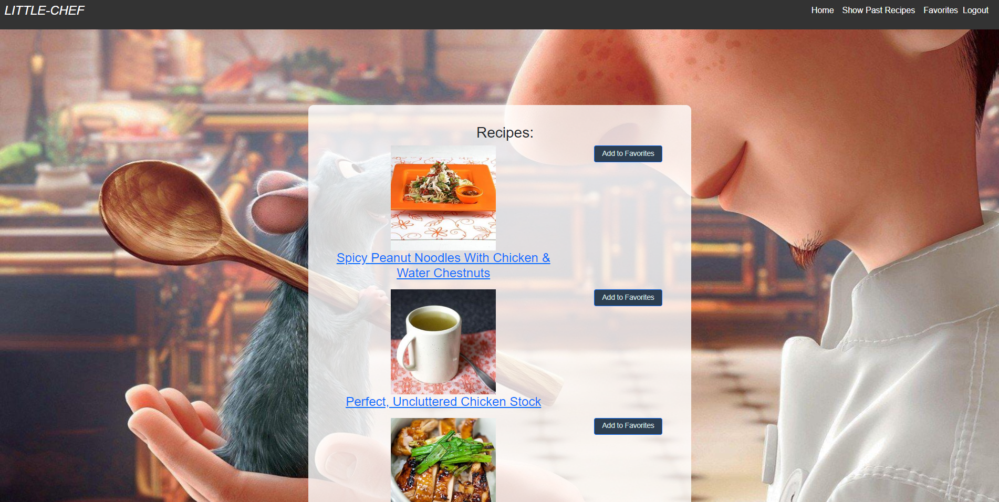

# Little-Chef

## Description

We made this Little Chef application for all of our busy adults who have trouble deciding what to cook. As a busy adult, I want to input food ingredients I have available, so that I can see a list of possible recipes using those ingredients, then decide on which one I want to cook.

## Table Of Contents

- [Installation](#installation)
- [Usage](#usage)
- [License](#license)
- [How To Contribute](#how-to-contribute)
- [Tests](#tests)
- [Questions](#questions)

## Installation

Please run 'npm install' in command line terminal to install all the require npm packages for this project.

## Usage

To run this Little Chef application, please visit https://remys-little-chef-64326918dfaf.herokuapp.com/ .

Once there, if this is your first time, please click on the login button in the right hand corner, then the sign up button to make an account!

Once an account is made, you can enter ingredients and view the possible recipes made from those ingredients!

### Screenshots

Here is a screenshot of the Input Ingredients page

Here is a screenshot of the Recipe Results page:

Here is a screenshot of the Favorites page:  

 

## License

License Link: https://opensource.org/licenses/MIT

## How To Contribute

Please contribute at github.com/fzhao888/Little-Chef

## Tests

N/A

## Credits

HUGE shoutout to TA Emma for her immense support on this project. We could not have done this without her expertise in full stack and her guidance!

Another HUGE shoutout to the University of Minnesota Bootcamp, as we the 14-MVC mini project helped us tremendously!

Shoutout to https://github.com/pdupavillon/express-recaptcha/tree/master/example for demonstrating how to incorporate the ReCaptcha V3.

Shoutout to W3 schools for their stellar documentation on HTML, CSS, and JavaScript, we utilized their webpage to understand how to incorporate the ' go to top'  button
(https://www.w3schools.com/howto/howto_js_scroll_to_top.asp).

## Technologies Used

CSS and Bootstrap was used to style this Little Chef application.

Express and Node.js were used to create the RESTful API.

Handlebars.js was used as the HTML templating engine.

For the new techonology, ReCaptcha V3 was used to verify the user is not a bot upon login and signup.
Here is a link to the ReCaptcha V3 npm package: https://www.npmjs.com/package/express-recaptcha .

## Questions

If you have any questions, please here is our contact info:

### GitHubs:

---

fzhao888

epinedo3

XDSirius

Sowchirukuri

---

### Emails:

---

Frank Zhao: frank.zhao93@gmail.com
Enrique Pinedo: epinedo31@outlook.com
Yasmin Castillo: yasmin_c@outlook.com